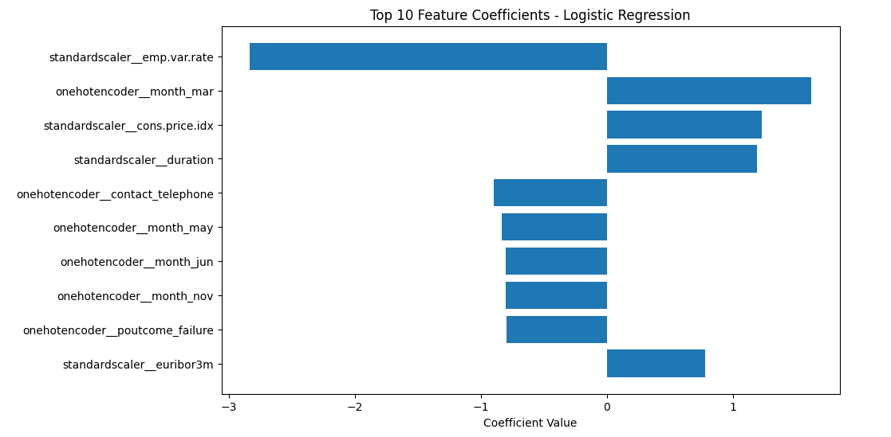
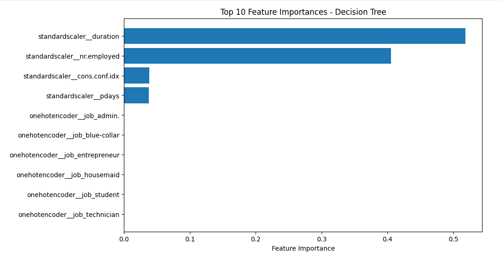

# Practical-Application-3

Comparing Classifiers

Link: [https://drive.google.com/file/d/1XYpJ52oUScDXxayHTkl4LXpEbI_AUHTE/view?usp=sharing]

## Understanding Data
The dataset collected is related to 17 campaigns that occurred between May 2008 and November 2010, corresponding to a total of 79354 contacts.

##  Understanding the Features
The "default" column has ~20% as "unknown", ~80% as "no", and very small amount as "yes". Since this is imbalanced with the majority as "no" and rest as "unknown", I will drop the "default" column.
I will drop 'duration' because the notes mention that this is highly correlated with output variable and should only be used for benchmarking, not predicting**

## Understanding the Task
The overall goal is to be able to lead a successful, targeted campaign by only contacting and allocating resources towards limited clients that are most likely to subscribe to a deposit.
The business objective is to determine what factors lead to a successful contact through the creation of a model that predicts the success of a contact with a variety of features.

## Baseline Model
We use a baseline, dummy model for comparison that only chooses the most frequest class.
Baseline Accuracy: 0.888
Baseline Precision: 0.000000
Baseline Recall: 0.000000
Baseline F1-score: 0.000000

## Simple Model
Accuracy: 0.911467
Precision: 0.667804
Recall: 0.422606
F1-score: 0.517637

The accuracy ~91% of the logistic regression model is higher than the dummy classifier that predicts the most frequent class with accuracy ~88%.

## Model Comparisons
                 Model  Train Time (s)  Train Accuracy  Test Accuracy
0  Logistic Regression            1.43           0.912          0.911
1                  KNN            0.22           0.927          0.902
2        Decision Tree            0.64           1.000          0.889
3                  SVM           29.80           0.922          0.911

Logistic regression and SVM had the highest accuracy, but SVM took significantly longer time to train. KNNs were relatively quick to train but had ~1% lower accuracy. Decision trees has the lowest accuracy.
Accuracy, however, can be misleading. The target variable y is imbalanced, so it is best to look also at precision, recall, and F1-score to have a clearer picture on overall model performance. I will do this in the next step when improving the model.

## Improving the Model

Logistic Regression Best parameters found:  {'model__C': 10}
KNN Best parameters found:  {'model__n_neighbors': 7}
Decision Tree Best parameters found:  {'model__max_depth': 3}
SVM Best parameters found:  {'model__kernel': 'rbf', 'model__gamma': 'scale', 'model__C': 1}

           Model  Train Time (s)  Train Accuracy  Test Accuracy  Precision  \
0        log_reg           21.46           0.912          0.911      0.664   
1            knn           32.57           0.922          0.904      0.607   
2  decision_tree            5.12           0.908          0.910      0.600   
3            svm          311.28           0.864          0.858      0.344   

   Recall  F1-score  
0   0.422     0.516  
1   0.402     0.484  
2   0.587     0.594  
3   0.291     0.315  

**Decision Tree was the fastest among all the models with 91% accuracy. SVM took the most training time.**
**In terms of test accuracy, logistic regression and decision tree has the highest accuracy.**
**Since our target variable is imbalanced, we also look at precision, recall, and F1-score. Logisitc regression has the highest precision. However, decision trees have the highest recall and F1-score. SVM had low precision, recall, and F1-score.**
**Based on this analysis, it looks like decision trees are the strongest in terms of speed, performance, and interpretability. Logistic regression are the second best with also adequate speed and performance.**

## Findings

  

  

*   Higher employment variation rate reduces likelihood of subscription.
*   March contacts have a higher chance of subscription.
*   Higher consumer price index and longer call durations increase likelihood.
*   Hall duration is the strongest predictor.
*   More employed people in the quarter slightly increases subscriptions.

